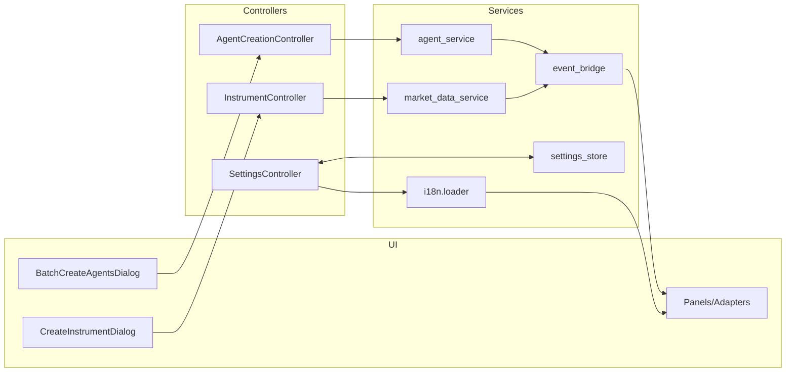

# Design Document

## Overview
本设计覆盖本期前端改动与缺陷修复：
- R1 创建新标的：新增“标的创建”对话框与推导计算，接入统一控制器与事件总线；
- R2 批量创建多策略散户：新增批量创建弹窗、进度反馈与可取消能力，复用既有 Agent 创建控制器；
- R3 智能体统一配置/蒸馏 API：抽象统一控制面方法并透传至后端；
- B1 语言切换：统一国际化加载、即时切换与持久化；
- B2 智能体状态刷新：事件驱动优先，轮询兜底，确保 UI 与后端一致。

## Steering Document Alignment

### Technical Standards (tech.md)
- 前端以模块化面板与适配器为主，控制器暴露稳定 API，遵循单一职责；
- 事件优先：通过 app/event_bridge 与事件服务驱动 UI 刷新；
- 可观察性：结构化日志与指标埋点（刷新延迟、创建成功率等）。

### Project Structure (structure.md)
- 新增/修改点严格落位到 app 下列分层：
  - 面板/对话框：app/panels, app/ui
  - 适配器：app/ui/adapters
  - 控制器：app/controllers
  - DTO：app/core_dto
  - 服务：app/services
  - 工具：app/utils

## Code Reuse Analysis

### Existing Components to Leverage
- app/controllers/agent_creation_controller.py：用于 R2 的批量创建入口；
- app/controllers/market_controller.py（或新增 instrument_controller）：用于 R1 创建标的；
- app/services/market_data_service.py, app/services/leaderboard_service.py, app/services/export_service.py：刷新/导出复用；
- app/i18n/loader.py 与 app/i18n/*.json：用于 B1 国际化切换；
- app/state/settings_store.py：语言偏好持久化；
- app/services/log_stream_service.py, app/event_bridge.py：事件分发与订阅（B2）；
- app/ui/adapters/* 与 app/panels/*：面板适配器与 UI 复用；
- app/core_dto/*：Agent/Account/Trade/Snapshot 等 DTO。

### Integration Points
- 统一控制器 → 后端 API（services/* 或 HTTP/RPC）：创建标的、创建/配置/蒸馏智能体；
- 事件总线：instrument-created、agent-status-changed 等事件；
- 存储/缓存（若前端侧持久）：settings_store（语言偏好、布局等）。

## Architecture

- 模式：Controller + Service + Adapter + Panel 分层；事件驱动刷新，轮询兜底；
- 校验：前端进行就地校验与推导计算；
- 弹窗/面板：均采用可停靠/可复用组件，遵循 SRP；
- 安全：脚本/配置经 AST 与黑名单校验（沿用 app/security）。

## Components and Interfaces

### R1: CreateInstrumentDialog（新增）
- Purpose: 提供“创建标的”弹窗与三元推导；
- Interfaces:
  - open(): 打开弹窗
  - onInputChange(fields): 校验并进行推导计算
  - submit(payload): 调用 InstCtrl.create_instrument(payload)
- Dependencies: InstrumentController, i18n, validators/utils
- Reuses: app/ui 现有对话框基础、通知中心与格式化工具

### InstrumentController（新增或扩展）
- Purpose: 统一标的管理入口；
- Interfaces:
  - create_instrument(name, symbol, price, float_shares, market_cap, total_shares)
- Dependencies: market_data_service / instrument_service（后端接口代理）, event_bridge
- Reuses: 结构化日志、错误处理工具

### R2: BatchCreateAgentsDialog（新增）
- Purpose: 批量创建多策略散户弹窗，带进度与取消；
- Interfaces:
  - open(), validate(), start(n, capital, strategy, seed?)
  - cancel(): 请求中止
- Dependencies: AgentCreationController, notifications
- Reuses: 进度条组件、通知中心、已有适配器与列表刷新逻辑

### AgentCreationController（扩展）
- Purpose: 提供批量接口与统一 create/update/configure/distill 入口（R3 配套）；
- Interfaces:
  - batch_create_multi_strategy(count, capital, strategy, seed?) -> progress stream
  - configure(agent_id, payload)
  - distill(agent_id, payload)
- Dependencies: agent_service, event_bridge, metrics_adapter

### SettingsController（扩展）
- Purpose: 统一语言切换与持久化；
- Interfaces:
  - set_language(locale): settings_store.persist + i18n.reload(locale) + Panels.refresh()
- Dependencies: settings_store, i18n.loader, panels registry

### Panels/Adapters（增量）
- Purpose: 订阅事件并刷新：market, agents, leaderboard 等；
- Interfaces:
  - subscribe(events): agent-status-changed, instrument-created
  - refresh(): 按需重拉数据（兜底）

## Data Models

### InstrumentCreatePayload
- name: str
- symbol: str
- initial_price: float
- float_shares: int
- market_cap: float
- total_shares: int

### BatchCreateAgentsPayload
- count: int
- initial_capital: float
- initial_strategy: str
- seed?: int

### AgentConfigPayload
- agent_id: str
- params: dict

## Error Handling

### 输入校验失败
- Handling: 阻止提交，表单就地提示，字段高亮，给出修复建议；
- User Impact: 不会发送网络请求，保持输入；

### 后端创建/配置失败
- Handling: 展示错误详情，允许重试；批量创建显示成功/失败统计；
- User Impact: 已创建对象在 UI 中可见，失败的可重试；

### 事件缺失或延迟
- Handling: 退避轮询（2s 起，指数退避），直至状态一致；
- User Impact: UI 最终一致，提示“正在同步…”微文案。

## Testing Strategy

### Unit Testing
- 校验/推导计算：价格/市值/流通股边界；
- 控制器接口：参数校验与错误分支；

### Integration Testing
- 创建标的 → 列表/图表可见；
- 批量创建 → 列表与排行榜刷新，进度/取消；
- 语言切换 → 面板标题/按钮即时更新并持久；

### End-to-End Testing
- 典型路径：创建标的、批量创建、切换语言、观察智能体状态自动刷新；
- 异常路径：网络失败、部分成功、事件迟到，确保兜底刷新生效。

