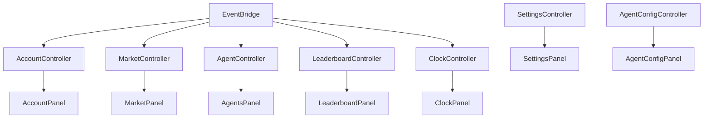

# Design Document

## Overview
本设计文档定义前端 Phase 1（requirements 已批准）在 PySide6 桌面应用中实现账户/行情/智能体/排行榜/启停读档/设置/智能体创建与配置版本管理等功能的技术方案。整体采用“事件驱动 + 控制器/面板分层 + 可插拔注册表”架构，复用后端 EventBus / 账户 & 智能体 / 行情 / Leaderboard / SimClock API，通过 EventBridge 将后台事件批处理转为 Qt 信号，支持可选 Redis 加速与本地回退。强调模块内聚、面板解耦、统一数据模型 DTO、热更新安全校验与一致性回滚。批量创建智能体仅限散户型（MultiStrategyRetail / Retail）代理，不支持模型类（如 PPO / Transformer）批量实例化。

## Steering Document Alignment
### Technical Standards (tech.md)
- 遵循分层解耦：UI(Panel)↔Controller↔Service/Bridge；不在 UI 直接做业务逻辑。
- 可扩展性：指标、策略上传校验、风险提示通过注册表与插件点暴露（IndicatorRegistry / ASTRuleRegistry）。
- Observability First：关键交互产生结构化日志 + 指标；统一 metrics 埋点名规范。
- Deterministic：读档按 snapshot_id / simday 回滚，导出基于一致快照。
- Fail Fast：参数校验 / AST 校验失败即时阻断，不进入运行态。

### Project Structure (structure.md)
(尚无 tech/structure steering 文档，遵循现有项目 README 与 product.md 原则)；文件统一放入 app/ 下子目录：
- app/main.py (入口)
- app/core_dto/ (DTO & pydantic 模型)
- app/event_bridge.py
- app/services/ (前端侧轻量服务 + API client + 缓存)
- app/controllers/ (业务聚合与状态机)
- app/panels/ (UI 组件, 每面板独立目录)
- app/indicators/ (前端指标计算 & 注册)
- app/i18n/
- app/utils/ (节流, 虚拟列表, 异步执行, 格式化)
- app/security/ (AST/上传校验)
- app/state/ (全局 AppState / SettingsState / Cache)

## Code Reuse Analysis
### Existing Components to Leverage
- infra/event_bus.EventBus：复用订阅机制（或 Redis fallback）。
- core.const.EventType：事件类型常量复用避免魔法值。
- services/* 已有服务：AccountService / OrderService / SimClock / Leaderboard 相关函数作为后端 API 接入点。
- rl/account_adapter.py 未来用于 RL 面板延伸（本阶段只记挂接点）。
- observability/metrics.py：产生日志与指标字段名对齐。

### Integration Points
- 事件流：EventBus → EventBridge（批量）→ Qt Signals → Panels。
- 后端 API：通过 app/services/api_client.py 封装 (REST / 内部 Python 调用 / RPC 适配层)。
- 数据模型：persistence 模型字段映射 → 前端 core_dto.* DTO；只保留必要字段，时间以 int(ms) / ISO8601 统一。
- 缓存：Redis (pub/sub channels: snapshot, trade, account, agent_meta, leaderboard)；若 REDIS_ENABLED=False → 本地订阅。

## Architecture
采用中介 + 控制器：
- EventBridge 负责事件聚合节流、反压、故障回退（Redis→本地）。
- Controllers 执行数据合并、增量 diff、版本控制与 Panel 状态同步。
- Panels 只关心渲染和用户交互发出 Intent (命令对象)；Intent 由 Controller 解析执行。
- 全局状态 store（轻量）存放：当前账户、symbol watchlist、语言/主题、时钟状态、活动智能体缓存索引。
- 指标计算在独立线程池（QThreadPool + QRunnable / concurrent.futures）异步执行，结果回主线程更新。

### Modular Design Principles
- 每个面板独立子目录 (panel.py + widgets + model.py)。
- 共享工具拆分到 utils/；避免跨面板直接 import。
- DTO 层隔离：除 DTO 外不得直接依赖 ORM / 原始后端对象。
- 事件处理器回调分层：Bridge → Controller Adapter → Domain Reducer → Store → Signal → Panel。



## Components and Interfaces
### EventBridge
- Purpose: 聚合后端事件/Redis 消息 → 分类队列 → 定时批量发射 Qt 信号。
- Interfaces:
  - start()/stop()
  - on_event(evt_type, payload)
  - signals: snapshotBatch(list), trades(list), accountUpdate(dto), agentMeta(dto), leaderboardDelta(list), clockState(dto)
- Dependencies: event_bus, redis(sub optional), throttle util。
- Reuses: infra.event_bus

### AccountController
- Purpose: 账户/持仓/盈亏汇总、阈值告警、导出一致性快照。
- Interfaces: handle_account(dto), export_positions(path), get_current_snapshot_id()。
- Dependencies: AccountService API, ExportService, AppState。

### MarketController
- Purpose: 行情快照增量合并、逐笔成交滚动窗口、技术指标请求/缓存、图表数据下钻。
- Interfaces: apply_snapshots(batch), append_trades(list), request_symbol_detail(symbol), toggle_indicator(symbol, name, params)。
- Dependencies: IndicatorRegistry, MarketDataService, BarsCache。

### AgentController
- Purpose: 智能体列表加载、状态控制、(仅散户型)批量创建进度、日志流；模型类(PPO/Transformer)仅单实例创建。
- Interfaces: list_agents(), control(agent_id, action), batch_create_retail(config), tail_logs(agent_id, n)。
- Constraints: batch_create_retail 仅允许类型 in {Retail, MultiStrategyRetail}；对其他类型调用返回业务错误 AGENT_BATCH_UNSUPPORTED。
- Dependencies: AgentService, LogStreamService。

### LeaderboardController
- Purpose: 指标计算触发/缓存、排名变化 Δ、导出。
- Interfaces: refresh(window_spec), change_sort(metric), export(file_path)。
- Dependencies: LeaderboardService, MetricsFormatter。

### ClockController
- Purpose: 虚拟时钟启停/暂停/读档/回滚一致性。
- Interfaces: start(), pause(), stop(), load_simday(day), current_state()。
- Dependencies: ClockService, RollbackService。

### SettingsController
- Purpose: i18n/主题/刷新频率/布局/告警阈值持久化。
- Interfaces: set_language(lang), set_theme(theme), set_refresh_rate(r), save_layout(json), set_alert(rule)。
- Dependencies: SettingsStore, LayoutPersistence。

### AgentCreationController
- Purpose: 新建智能体与脚本上传校验。
- Interfaces: validate_script(path), create_agent(form_dto), save_template(name, form_dto)。
- Dependencies: ScriptValidator(ASTRuleRegistry), AgentService。

### AgentConfigController
- Purpose: 参数查看、热更新、版本列表、回滚。
- Interfaces: list_versions(agent_id, page), apply_update(agent_id, diff), rollback(agent_id, version_id)。
- Dependencies: AgentService, VersionStore。

### IndicatorRegistry
- Purpose: 指标注册/实例化协议。
- Interface: register(name, factory), build(name, params) → Indicator
- Dependencies: none

### ExportService
- Purpose: 导出 CSV/Excel；统一 snapshot_id 绑定。
- Interface: export(type, data, meta)

## Data Models
### DTO 账户 (AccountDTO)
```
AccountDTO:
- account_id: str
- cash: float
- frozen_cash: float
- positions: list[PositionDTO]
- realized_pnl: float | None
- unrealized_pnl: float | None
- equity: float
- utilization: float
- snapshot_id: str
- sim_day: str
```
### PositionDTO
```
PositionDTO:
- symbol: str
- quantity: int
- frozen_qty: int
- avg_price: float
- borrowed_qty: int
- pnl_unreal: float | None
```
### SnapshotDTO
```
SnapshotDTO:
- symbol: str
- last: float
- bid_levels: list[tuple[float,float]]  # px,qty
- ask_levels: list[tuple[float,float]]
- volume: int
- turnover: float
- ts: int
- snapshot_id: str
```
### TradeDTO
```
TradeDTO:
- symbol: str
- price: float
- qty: int
- side: str  # buy/sell from perspective of account if needed
- ts: int
```
### AgentMetaDTO
```
AgentMetaDTO:
- agent_id: str
- name: str
- type: str
- status: str  # RUNNING/PAUSED/STOPPED/INACTIVE
- start_time: int | None
- last_heartbeat: int | None
- params_version: int
```
### LeaderboardRowDTO
```
LeaderboardRowDTO:
- agent_id: str
- return_pct: float
- annualized: float | None
- sharpe: float | None
- max_drawdown: float | None
- win_rate: float | None
- equity: float | None
- rank: int
- rank_delta: int | None
```
### ClockStateDTO
```
ClockStateDTO:
- status: str  # RUNNING/PAUSED/STOPPED
- sim_day: str
- speed: float  # compression ratio or multiplier
- ts: int
```
### AgentVersionDTO
```
AgentVersionDTO:
- version: int
- created_at: int
- author: str
- diff_json: dict
- rollback_of: int | None
```

## Error Handling
### Error Scenarios
1. 脚本上传危险导入
   - Handling: ASTRuleReject → raise ValidationError → UI toast + 日志记录 action=script_upload_fail
   - User Impact: 弹窗列出禁止模块
2. Redis 连接断开
   - Handling: Bridge fallback 本地 EventBus + 指标 metrics.redis_fallback++
   - User Impact: 状态栏黄色提示“Redis 断开，使用本地事件流”
3. 回滚失败 (数据不一致)
   - Handling: 事务回滚 / 还原旧状态 / 发布 error log / 禁用启动按钮
   - User Impact: 弹窗“回滚失败已还原”
4. 热更新参数校验失败
   - Handling: 不写入版本；返回错误 detail；保留旧显示
   - User Impact: Inline 表单错误高亮
5. 行情高频导致 UI 卡顿
   - Handling: 批量节流 + 超过队列上限丢弃最旧并计数 dropped_events
   - User Impact: 角标显示“负载高：已丢弃X”
6. 指标计算超时
   - Handling: 线程任务取消 / 标记 stale
   - User Impact: 指标列显示“--”
7. 批量创建零售智能体部分失败
   - Handling: 返回 success_ids / failed(list[reason])
   - User Impact: 对话框列出失败条目
8. 非零售类型调用批量创建
   - Handling: 返回业务错误代码 AGENT_BATCH_UNSUPPORTED
   - User Impact: toast“该智能体类型不支持批量创建”

## Testing Strategy
### Unit Testing
- DTO 序列化/反序列化
- AST 安全规则 (白名单/黑名单)
- IndicatorRegistry + 指标计算核心 (MA, MACD, RSI)
- EventBridge 节流逻辑 (批量聚合/丢弃策略)
- AgentController: 非零售类型批量创建拒绝逻辑

### Integration Testing
- 模拟事件流：账户+快照+成交 → Controller 状态一致性 (equity 计算, 持仓映射)
- 智能体创建→参数版本更新→回滚链路
- 回滚功能：加载历史 simday 后导出与历史基准比对 (<0.01% 差异)
- 批量创建仅零售：尝试零售成功 & PPO 批量失败校验

### End-to-End Testing
- 场景1：启动时钟→下单→成交→账户/行情面板同步延迟 <250ms
- 场景2：批量创建 10 个零售散户智能体(MultiStrategyRetail)→排行榜刷新→导出 CSV
- 场景3：读档回滚→再次启动→继续产生事件（无重复快照）
- 场景4：切换语言 / 主题 / 刷新频率实时生效
- 场景5：脚本上传危险 import 拦截
- 场景6：对 PPO 类型执行批量创建 → UI 返回“不支持”并无新实例

## Additional Technical Details
### Event Throttling
- snapshot 队列：最大 2000 条；定时器 100ms flush；若 > 阈值N 丢弃 oldest FIFO。
- trades 队列：无合并，按批推送（≤500 条/批）。

### Indicator Execution
- 统一接口 calc(series: np.ndarray, params: dict) -> dict[str, float|np.ndarray]
- 结果缓存 key: (symbol, indicator_name, param_hash, last_bar_ts)

### Versioning Strategy
- 参数热更新写 VersionStore(JSON) + emit AGENT_META_UPDATE(version=v)
- 回滚生成新版本 (rollback_of=旧版号)

### Security / Sandbox
- ASTRule: 禁止 import os,sys,subprocess,socket; 禁止 Attribute: __import__, eval, exec; 文件大小限制/速率限制计数器。

### Internationalization
- 翻译表加载后生成 lazy gettext-like wrapper；缺失 key 记录 metrics.i18n_missing++。

### Consistency for Export
- 调用 ExportService 前获取统一 snapshot_id；各模块取当前缓存数据基于该 id 深拷贝。

### Future Hooks
- RL 面板（占位：AgentController 预留 get_rl_stats(agent_id)）
- 事件外部化：Bridge 可插入 KafkaProducerAdapter。

## Rationale / Trade-offs
- 采用批处理信号降低 GUI 抖动；牺牲极端低延迟（+最多100ms），换稳定帧率。
- 统一 DTO 减少直接依赖后端 ORM，便于未来远程部署。
- 指标线程池而非异步协程：pyqtgraph 渲染主线程需求；避免事件循环嵌套复杂性。
- 限定批量创建范围降低复杂度/资源占用与误用风险。

## Open Issues / Risks
- 大量智能体 (>500) 列表刷新性能需要虚拟滚动实现（本阶段基础实现 + TODO）。
- Redis 回退频繁切换可能导致重复批量（需幂等检查 snapshot_id）。
- 若后续引入新“半重量级”模型类型是否允许小批量？暂不支持，需后续评估。

## Conclusion
设计(修订版) 已纳入“仅零售类型支持批量创建”反馈，保持其它结构不变；满足全部已批准需求与新增约束，为任务分解提供一致与可执行蓝图。
