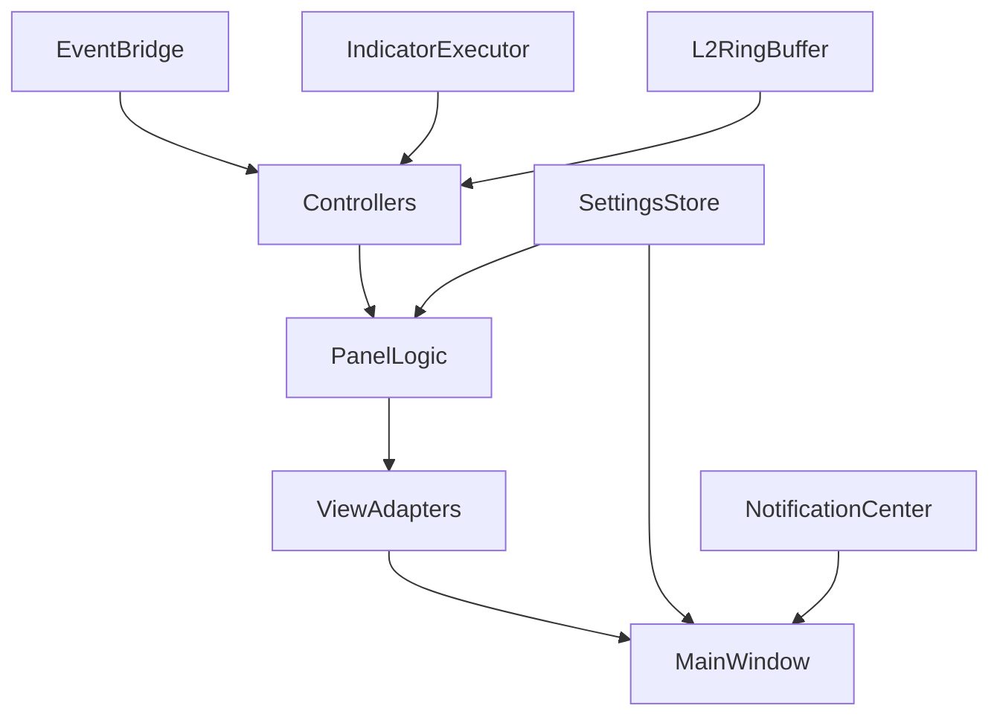

# Design Document

## Overview
本设计文档针对已批准的前端需求 (R1~R25)，定义将“已有逻辑层(Panel 逻辑类 + Controller + Service)”扩展为“完整 PySide6 GUI 应用”的技术方案。目标：
- 构建可停靠 (dock/tab) 的主窗口容器，支持延迟实例化与布局持久化。
- 将现有纯逻辑面板与新的 UI 组件分层（ViewAdapter），保持测试友好。
- 引入通知中心、指标异步计算、L2/逐笔 ring buffer、模板存储、Redis 事件桥接、回滚一致性校验等增强模块。
- 满足性能/可扩展/可观测的非功能性要求，并为后续任务分解提供精确接口。

## Steering Document Alignment
### Technical Standards (tech.md)
(当前 tech.md 未提供；设计遵循已存在 Product/结构实践)
- 分层解耦：Service / Controller / PanelLogic / ViewAdapter / UI Shell。
- 纯逻辑可 headless：所有数据加工在 Controller / PanelLogic，不在 QWidget 中做重计算。
- 可观测性：关键路径（切换账户/加载 symbol/指标计算/回滚）埋点 metrics + 结构化日志。
- 插件化：面板通过 registry + BasePanel 接口；新面板无需修改核心窗口。

### Project Structure (structure.md)
(结构文档缺失，设计沿用既有目录 + 新增子目录与命名规范)
- app/ui/  (新增) 纯 PySide6 组件与适配器，不放业务逻辑。
- app/panels/* 保留逻辑模型；新增 BasePanelLogic (抽象)；现有面板继承轻量基类或保持原样 + 适配层。
- app/ui/adapters/PanelAdapters 映射逻辑面板 -> QWidget。
- app/ui/main_window.py 扩展主窗口：DockManager / PanelHost。
- app/notification/ 通知中心与数据模型。
- app/l2/ L2RingBuffer 与逐笔聚合。
- app/templates/ 策略配置模板存储。

## Code Reuse Analysis
现有可直接复用：
- 面板逻辑：account_panel, market.panel, agents.panel, leaderboard.panel, clock.panel, settings.panel, agent_config.panel。
- Panel registry：app/panels/registry.py (满足惰性创建与替换)。
- Controllers / Services：无须重写，只增加事件订阅接口 & 若干补充方法。
- SettingsStore / LayoutPersistence：用于主题、语言、布局落盘；扩展布局键。
- ScriptValidator / metrics / struct_logger：直接复用。

### Existing Components to Leverage
- register_panel/get_panel/list_panels：主窗口动态装载。
- MarketDataService：扩展 detail 指标与逐笔请求接口 ensure_ticks(symbol)。
- ExportService：扩展 xlsx 输出。
- RollbackService：添加校验钩子。

### Integration Points
- EventBus / RedisSubscriber：通过 EventBridgeAdapter 统一推入 Controller 增量合并。
- SettingsStore -> 主窗口广播语言/主题事件。
- MetricsAdapter -> Qt 定时器 flush。
- TemplateStore(新增) -> AgentConfigPanel & AgentCreationDialog。
- NotificationCenter -> 所有模块（心跳超时/回滚完成/脚本校验失败/阈值触发）。

## Architecture

层级：
```
QApplication
  └── MainWindow (UI Shell)
        ├── PanelHost (Dock/Tab 管理 & LayoutPersistence 绑定)
        ├── StatusBar (metrics/clock quick view)
        ├── NotificationWidget (弹出/列表)
        ├── CommandPalette (可选后续)
Controllers/Services (后台线程/事件)
PanelLogic (现有) <-> ViewAdapter(QWidget)
Indicators ThreadPool / L2RingBuffer / TickAggregator
NotificationCenter / TemplateStore / CheckpointVerifier
```

数据流：
EventSource(Engine/Redis) -> EventBridgeAdapter(batch, throttle) -> Controllers(incremental merge) -> PanelLogic.get_view() -> ViewAdapter.update(vm) -> Qt repaint

### Modular Design Principles
- 单文件职责：每个 *Adapter 仅处理 UI 绑定与 minimal transform。
- 组件隔离：逻辑与 UI 分层；UI 不直接调用 Service，走 PanelLogic / Controller。
- 服务层独立：新增 L2RingBuffer / TemplateStore / NotificationCenter 均无 Qt 依赖。
- 工具模块化：throttle/debounce 复用 app/utils；新增 ui/throttle_qt.py (将逻辑节流调度到主线程)。



## Components and Interfaces

### 1. MainWindow (app/ui/main_window.py)
- Purpose: 统一 Dock 管理 / 面板装载 / 主题语言广播 / 指标 flush 定时器。
- Interfaces:
  - open_panel(name:str) -> QWidget
  - close_panel(name:str)
  - restore_layout(json_obj)
  - serialize_layout() -> dict
  - broadcast_settings(new_settings)
- Dependencies: PanelRegistry, SettingsStore, LayoutPersistence, NotificationCenter.
- Reuses: panels.registry, settings_panel.get_view。

### 2. PanelHost / DockManager (app/ui/docking.py)
- Purpose: 抽象停靠与 Tab 行为，封装 QDockWidget / QTabWidget 组合策略。
- Interfaces: add_panel(name, widget), remove_panel(name), set_visible(name,bool), list_open()。

### 3. BasePanelLogic (app/panels/base_logic.py)
- Purpose: 统一生命周期（attach/detach/apply_settings）给现有逻辑面板可选继承（保持向后兼容）。
- Interfaces: attach(context), detach(), apply_settings(settings_dict), get_view().

### 4. Panel ViewAdapters (app/ui/adapters/*)
示例 AccountPanelAdapter:
- Purpose: 将 AccountPanel.get_view() 数据绑定到 QTableView + summary widget。
- Interfaces:
  - bind(panel_logic:AccountPanel)
  - refresh() （被刷新定时器/事件调用）
  - update_view(model_dict) -> diff rows / highlight
- Dependencies: AccountPanel, Qt Models.

共需适配：Account / Market / Agents / Leaderboard / Clock / Settings / AgentConfig。

### 5. EventBridgeAdapter (app/event_bridge.py 扩展)
- Purpose: 支持本地 EventBus 与 Redis 模式二选一 + 批量节流。
- Interfaces:
  - start()
  - subscribe(event_type, callback)
  - enable_redis(url, channels)
  - stats() -> counters
- Behavior: 收集事件 -> 批量 (≤N ms 或 ≥M 条) flush -> 调用 Controller.on_events(batch)。

### 6. IndicatorExecutor (扩展现有 indicators)
- Purpose: 线程池异步计算 MA/MACD/未来指标。
- Interfaces:
  - submit(symbol, indicator_name, params) -> future
  - get_cached(key) -> result|None
  - invalidate(symbol)

### 7. L2RingBuffer & TickAggregator (app/l2/ring_buffer.py)
- Purpose: 高速逐笔与 L2 行情缓存；固定长度 O(1) push/pop。
- Interfaces: append_tick(tick_dto), get_recent(limit) -> list, snapshot_order_book()。
- 边界：容量满时丢弃最旧记录。

### 8. NotificationCenter (app/notification/center.py)
- Purpose: 标准化通知与告警分发。
- Interfaces:
  - push(type:str, message:str, source:str, data:dict|None)
  - list_recent(n:int) -> list[NotificationDTO]
  - mark_read(id)
  - on_new(callback)
- 事件来源：心跳超时、阈值告警、脚本校验失败、回滚一致性差异、指标计算异常。

### 9. TemplateStore (app/templates/store.py)
- Purpose: 策略参数模板 CRUD。
- Interfaces: save(name, params_dict), list(), load(name), delete(name)。
- Persistence: JSON (templates.json)。

### 10. CheckpointVerifier (app/rollback/verify.py)
- Purpose: 回滚后校验账户/持仓/拍快照摘要一致性 (R16)。
- Interfaces: verify(sim_day, context) -> VerificationReport {all_pass:bool, issues:list}
- 行为：采集 AccountController/MarketController/AgentController 摘要字段比对存档。

### 11. ExportFacade (扩展 ExportService)
- Purpose: 增加 Excel 输出 + meta sheet。
- Interfaces: export(window, rows, meta, fmt="csv|xlsx") -> path。

### 12. ThemeManager / I18nManager (app/ui/theme.py / i18n_bind.py)
- Purpose: 集中应用 QSS 与动态翻译刷新。
- Interfaces:
  - apply_theme(theme_name)
  - retranslate_all()
  - register_widget(widget, keys_map)

### 13. SettingsSync (app/ui/settings_sync.py)
- Purpose: 监听 SettingsStore 变化 -> 触发 ThemeManager & I18nManager & Clock speed 调整。
- Interfaces: start(), stop(); on_settings(changed_dict)。

### 14. AgentsLogViewer (app/ui/adapters/agents_log.py)
- Purpose: tail / page logs 集成到侧边弹出或底部面板。
- Interfaces: tail(agent_id), page(agent_id, page, size)。

### 15. PerformanceMonitor (app/observability/perf_monitor.py)
- Purpose: 采集 UI 主线程阻塞窗口 & 指标 flush 结果。
- Interfaces: record_phase(name, duration_ms), report().

## Data Models

### Panel View Models (Python TypedDict / dataclass 示意)
```
AccountView = {
  'account': { 'account_id':str, 'cash':float, 'equity':float, ... } | None,
  'positions': {'total':int,'page':int,'page_size':int,'items': [ {symbol, quantity, avg_price, pnl_unreal, pnl_ratio, highlight} ]},
  'filter': str|None
}

MarketView = {
  'watchlist': { 'symbols': [str], 'snapshots': { 'total':int, 'items':[ {symbol,last,volume,turnover,ts,snapshot_id} ] } },
  'filter': str|None, 'sort_by': str, 'selected': str | None
}

SymbolDetailView = {
  'symbol': str|None, 'timeframe': str, 'series': { 'ts':[], 'open':[], ... }|None,
  'snapshot': {...} | None, 'order_book': {'bids':[], 'asks':[]} | None,
  'trades': [ {ts, price, qty, side} ], 'indicators': { 'MA': [...], 'MACD': {...} } | None
}

LeaderboardView = { 'window': str, 'rows': [...], 'selected': {...}|None }
ClockView = { 'state': {status, sim_day, speed, ts}, 'checkpoints': [...], 'current_checkpoint': str|None }
SettingsView = { 'settings': {...}, 'layout': {...}, 'recent_changes': {...}|None }
NotificationDTO = { 'id':str, 'type':str, 'message':str, 'source':str, 'ts':int, 'read':bool }
```

### Internal Models
- TickDTO: {symbol, price, qty, side, ts}
- L2SnapshotDTO: {symbol, bids:[(p,q)], asks:[(p,q)], ts}
- TemplateDTO: {name:str, params:dict, created_at:int}
- VerificationReport: {all_pass:bool, issues:[{component, field, expected, actual}]}

## Error Handling

### Error Scenarios
1. 面板加载失败 (factory 抛出)  
   - Handling: 捕获 -> NotificationCenter.push(type="ERROR", source=panel_name)  
   - User Impact: 面板占位显示“加载失败”。
2. 指标计算超时 (>1s)  
   - Handling: future.cancel(); metrics.inc('indicator_timeout'); 通知 WARNING  
   - User Impact: 指标图层灰显。
3. Redis 连接失败  
   - Handling: fallback 本地事件队列 + metrics.inc('redis_fallback')  
   - User Impact: 无显著 UI 变化，日志提示。
4. 回滚校验失败  
   - Handling: VerificationReport.issues>0 -> 通知 ALERT + 日志  
   - User Impact: 通知中心红色标记。
5. 脚本校验失败  
   - Handling: AgentConfigPanel 返回 violations -> UI 展示行内错误  
   - User Impact: 新版本不创建。
6. 批量创建不支持类型  
   - Handling: 抛 AgentServiceError(code='AGENT_BATCH_UNSUPPORTED') -> UI toast  
   - User Impact: 终止后续创建，显示失败计数。
7. Layout 解析错误 (损坏 JSON)  
   - Handling: 备份损坏文件 -> 重新写入默认布局  
   - User Impact: 提示恢复默认布局。

## Testing Strategy

### Unit Testing
- 目标：确保逻辑与数据结构稳定。
- 范围：L2RingBuffer (长度裁剪/顺序)、IndicatorExecutor 缓存与超时、TemplateStore CRUD、CheckpointVerifier 差异检测、NotificationCenter push/list/mark_read。
- 方法：pytest；使用 fake time / monkeypatch 以避免真实 sleep。

### Integration Testing
- 目标：事件→控制器→面板逻辑→适配层数据绑定链路正确。
- 场景：
  1. SNAPSHOT 连续推送 → MarketPanel watchlist last 值更新节流。
  2. ACCOUNT_UPDATED → 持仓 highlight 根据阈值变化。
  3. 回滚执行 → ClockPanel state + VerificationReport 通知。
  4. 指标请求 → 异步完成后 detail view 包含指标数组。
  5. 批量创建智能体 → AgentsPanel 进度 & 心跳 stale 高亮。

### End-to-End Testing
- 目标：主窗口 GUI 关键用户旅程。
- Headless 模式模拟：使用 --headless + 注入 MockAdapters，或使用 Qt minimal platform。
- 用户旅程：
  1. 启动 → 打开全部面板 → 切换语言/主题。
  2. 添加自选/选择 symbol → 查看指标 → 切换 timeframe。
  3. 创建智能体 → 热更新版本 → 回滚版本。
  4. 创建 checkpoint → rollback → 验证通知。
  5. 导出排行榜 CSV/XLSX → 文件存在且含 meta。
- 性能断言：切换账户操作计时 <300ms；UI 卡顿指标 <50ms P95（通过 PerformanceMonitor 模拟采样）。

---
本设计为 tasks.md 生成提供：
- 模块/文件路径
- 公开接口
- 依赖与错误处理策略
将逐条映射 R1~R25 至具体任务（含新增/改造/测试）。
