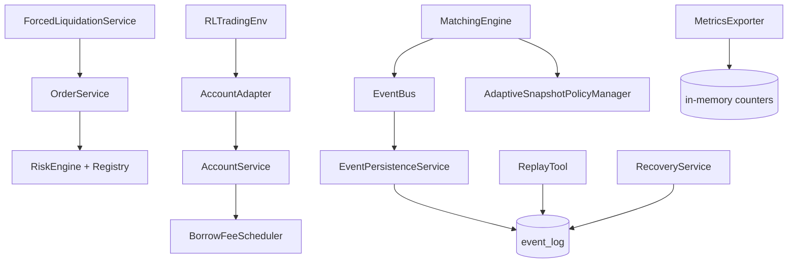

# Design Document

## Overview
本设计针对“platform-hardening”需求集，为 StockSim 增强稳定性、可回放性、风险精细化、卖空经济逻辑、可观测性、恢复能力与 RL 融合。设计坚持最小侵入：不破坏现有撮合/订单/账户主路径 API（OrderService.place_order / MatchingEngine.submit_order / AccountService）与现有数据模型兼容。通过新增独立服务组件与接口契约实现扩展、可插拔与渐进上线。

## Steering Document Alignment
(无正式 steering 文档，以下对齐原则基于 README 与现有结构约定)

### Technical Standards (tech.md 假定)
- 维持 services / core / infra / persistence 模块边界。
- 采用接口类 + 依赖注入（构造参数 / registry）减少耦合。
- 结构化日志统一使用 observability/struct_logger。

### Project Structure (structure.md 假定)
- 新服务统一放置于 services/ 下，以 *_service 或 *_engine 命名。
- 横切关注（metrics/export/recovery）放置 services/ 或 observability/ 下；接口定义放在 infra/ 或 services/base_interfaces.py（新增）。

## Code Reuse Analysis
利用现有：
- EventBus: 复用发布机制，扩展事件类型 + 可选事件镜像到持久化。
- AccountService: 增加借券费用调度钩子 + 结算后钩子回调。
- RiskEngine: 扩展为可注册多规则 (RiskRuleRegistry)。
- settings: 扩展配置组；复用 Pydantic 动态更新能力。
- Ledger: 复用记录 BORROW_FEE / LIQUIDATION_PNL / RECOVERY_ADJUST 交易流水。
- Snapshot: 复用结构，不修改核心 schema，仅新增策略调参事件与内部 self._adaptive_policy。

### Existing Components to Leverage
- core.matching_engine: 在撮合结尾钩子调用 AdaptiveSnapshotPolicyManager 回传统计。
- services.fee_engine: 参考费用计算模式扩展借券费用 (按日调度)。
- infra.unit_of_work: 持久化事件批量 flush。

### Integration Points
- Event 持久化: 新增 EventLogORM 表 + 批量写服务 EventPersistenceService。
- Replay: 使用 EventLogORM / Snapshot / Orders / Trades 重建内存状态。
- Recovery: 启动阶段读取 Orders/Positions/Snapshot + (可选) Event 重建。
- RL 集成: trading_env 引入 AccountAdapter 注入真实账户查询。

## Architecture

模块关系高层：


### Modular Design Principles
- 面向接口：IEventSink / IReplaySource / IRiskRule / IRecoveryStrategy。
- 组合优先：AdaptiveSnapshot 不修改 MatchingEngine 内部逻辑，仅通过 hooks 传输统计。
- 可并行演进：事件持久化可关闭；借券费用/强平调度可独立启用。

## Components and Interfaces

### AdaptiveSnapshotPolicyManager (ASPM)
- Purpose: 根据簿操作速率、成交密度动态调节 per-symbol snapshot 阈值。
- Interfaces:
  - on_book_op(symbol, op_type)->None
  - on_trade(symbol, trade)->force snapshot flag
  - current_threshold(symbol)->int
  - maybe_adjust(symbol)->(old,new,reason) 若变更则发布 SNAPSHOT_POLICY_CHANGED
- Dependencies: settings (基线/上下限), EventBus, metrics.
- Reuses: MatchingEngine hooks。

### EventPersistenceService (EPS)
- Purpose: 批量、异步/同步模式写入事件。
- Interfaces:
  - enqueue(event_dict)->None
  - flush(force:bool=False)->int 写入条数
  - background_loop() 50ms/阈值触发
- Dependencies: SQLAlchemy Session / UnitOfWork.
- Reuses: observability.logger.

### EventReplayService
- Purpose: 从 event_log 流重建订单簿和账户状态（dry-run）。
- Interfaces:
  - load_events(start_ts,end_ts|id_range)->Iterable
  - replay(events, mode='dry-run') -> ReplayReport
- Dependencies: MatchingEngine (新实例), AccountService (隔离内存), parsers.

### BorrowFeeScheduler
- Purpose: 日终/间隔计提借券费用。
- Interfaces:
  - run_daily(sim_day) -> n_fees
  - compute_fee(position)->fee
- Dependencies: AccountService (positions), settings.borrow_rate_map.

### RiskRuleRegistry + Extended RiskEngine
- Purpose: 插件化风险规则。
- Interfaces:
  - register(rule:IRiskRule)
  - evaluate(order, context)->List[RiskReject]
- IRiskRule: id, describe(), check(order, ctx)->Optional[RiskReject]
- Dependencies: Market data, positions, settings.

### MetricsExporter
- Purpose: 提供 HTTP 或 pull 函数接口导出 metrics。
- Interfaces: collect()->text/json
- Metrics: order_latency_hist, event_queue_size, persistence_failures_total, snapshot_threshold{symbol}, risk_reject_total{rule}, crash_counter。

### RecoveryService
- Purpose: 启动恢复 / 校验一致性。
- Interfaces:
  - recover(mode='auto') -> RecoveryReport
  - validate(report)->bool
- Dependencies: DB models (orders, positions, snapshots, event_log)。

### ForcedLiquidationService
- Purpose: 当维持保证金不足时生成强平订单。
- Interfaces:
  - evaluate_accounts()->List[Action]
  - submit_liquidation(account, positions)->orders
- Dependencies: Risk metrics, OrderService.

### RL AccountAdapter / VectorizedEnvWrapper
- Purpose: 将真实账户数据注入 RL 观测；批量 step。
- Interfaces:
  - get_account_state(account_id)->AccountState
  - step_batch(actions[])->(obs,reward,done,info[])
- Dependencies: AccountService, MatchingEngine snapshots.

### ConfigHotReloader
- Purpose: 热更新 settings 子集。
- Interfaces:
  - apply(patch_dict)->ChangedFields
- Safeguard: 白名单字段 + 验证。

## Data Models

### EventLogORM (新增表 event_log)
```
id BIGINT PK
seq BIGINT AUTO (单调) *可与 id 合并
ts_ms BIGINT NOT NULL
type VARCHAR(64) NOT NULL
symbol VARCHAR(32) NULL
payload JSON / TEXT (压缩可选)
shard SMALLINT DEFAULT 0 (预留分片)
```
Indexes: (ts_ms), (type), (symbol, ts_ms)

### RecoveryCheckpointORM (可选)
```
id BIGINT PK
ts_ms BIGINT
snapshot_id BIGINT (引用 snapshots)
comment VARCHAR(128)
```

### Ledger 扩展
- fee_type 枚举新增: BORROW_FEE, LIQUIDATION_PNL, RECOVERY_ADJUST。
(如当前实现使用单列 fee + tax，可通过 side 或 extra_json 扩展: ledger.extra_json {"kind":"BORROW_FEE"})

### RiskReject 结构（内存对象）
```
RiskReject {
  rule_id: str,
  code: str,        # 机器可解析 SHORT_INVENTORY_EXHAUSTED
  message: str,
  severity: str,    # WARN/BLOCK
}
```

## Error Handling

### Error Scenarios
1. Event 写入失败（数据库暂不可用）
   - Handling: 放入内存重试队列 + 指数退避（上限 N 次）; 超限丢弃并计数 persistence_dropped_total。
   - User Impact: 事件回放完整性可能受影响，系统发 PERSISTENCE_DEGRADED。
2. Recovery 不一致（订单/持仓/快照差异）
   - Handling: 切入 READONLY 模式，拒绝新订单，发布 RECOVERY_FAILED。
   - User Impact: 需人工干预或二次重放。
3. 借券费用重复计提
   - Handling: 基于 positions.last_borrow_fee_day 防重；若发现重复写入则回滚并日志 ERROR。
   - User Impact: 不影响撮合，费用保持幂等。
4. 风险规则抛异常
   - Handling: 捕获后记录 risk_rule_error_total{rule}；该规则视为拒绝或忽略（配置化 fail_open/fail_closed）。
   - User Impact: 可配置策略，默认 fail_closed 保障安全。
5. 热更新非法值
   - Handling: 事务回滚并返回 INVALID_SETTING 事件；不修改原值。
   - User Impact: 提示具体字段与原因。

## Testing Strategy

### Unit Testing
- AdaptiveSnapshot: 模拟不同 op 速率验证阈值调整、成交强制刷新不受影响。
- RiskRuleRegistry: 注入若干 mock 规则验证顺序与聚合结果。
- BorrowFeeScheduler: 多日执行防重复。
- EventPersistenceService: 批量 flush / 重试 / 丢弃计数。
- RecoveryService: 构造缺口事件检测失败路径。

### Integration Testing
- 下单+高频撮合+验证 snapshot 阈值变化事件。
- 卖空→借券→日切→借券费计提→回补归还。
- FOK 风险预检测：可满足 vs 不可满足。
- 强平触发：资产跌破阈值→生成强平订单→Ledger 记录 LIQUIDATION_PNL。
- Event 回放：生成真实撮合流→重放并校验报告。

### End-to-End Testing
- 场景：启动→撮合→崩溃(模拟)→恢复→继续撮合；校验恢复报告与后续一致性。
- RL 环境：vectorized=4 并行 step，对比单环境吞吐 ≥3x；卖空被拒绝 reward penalty 注入。
- 观测性：人工注入 DB 故障，验证 PERSISTENCE_DEGRADED & 指标输出。

