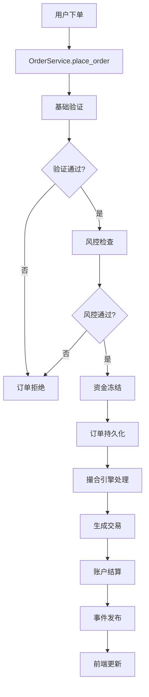

# StockSim 项目架构分析报告

## 项目概述

StockSim 是一个基于 Python 的股票仿真交易平台，集成了撮合引擎、账户管理、风险控制、策略执行和强化学习等功能。项目采用前后端分离架构，后端使用 SQLAlchemy 进行数据持久化，前端使用 PySide6 (Qt) 构建桌面应用。

## 1. 整体架构

### 1.1 架构层次

```
┌─────────────────────────────────────────────────────────────┐
│                    前端层 (FE/)                              │
│  ┌─────────────┐ ┌─────────────┐ ┌─────────────┐           │
│  │  主窗口     │ │  图表组件   │ │  订单组件   │           │
│  │ MainWindow  │ │ ChartCtrl   │ │ OrderEntry  │           │
│  └─────────────┘ └─────────────┘ └─────────────┘           │
└─────────────────────────────────────────────────────────────┘
                              │
                              ▼
┌─────────────────────────────────────────────────────────────┐
│                   事件桥接层 (EventBridge)                   │
│  ┌─────────────────────────────────────────────────────────┐ │
│  │            Qt Signal ↔ Event Bus 转换                  │ │
│  └─────────────────────────────────────────────────────────┘ │
└─────────────────────────────────────────────────────────────┘
                              │
                              ▼
┌─────────────────────────────────────────────────────────────┐
│                    业务服务层 (services/)                    │
│  ┌─────────────┐ ┌─────────────┐ ┌─────────────┐           │
│  │ 订单服务    │ │ 账户服务    │ │ 风控引擎    │           │
│  │OrderService │ │AccountSvc   │ │RiskEngine   │           │
│  └─────────────┘ └─────────────┘ └─────────────┘           │
│  ┌─────────────┐ ┌─────────────┐ ┌─────────────┐           │
│  │ 撮合引擎    │ │ 标的服务    │ │ 策略监督    │           │
│  │MatchingEng  │ │InstrumentSvc│ │StrategySup  │           │
│  └─────────────┘ └─────────────┘ └─────────────┘           │
└─────────────────────────────────────────────────────────────┘
                              │
                              ▼
┌─────────────────────────────────────────────────────────────┐
│                    核心层 (core/)                           │
│  ┌─────────────┐ ┌─────────────┐ ┌─────────────┐           │
│  │ 订单模型    │ │ 交易模型    │ │ 快照模型    │           │
│  │Order        │ │Trade        │ │Snapshot     │           │
│  └─────────────┘ └─────────────┘ └─────────────┘           │
│  ┌─────────────┐ ┌─────────────┐ ┌─────────────┐           │
│  │ 订单簿      │ │ 标的模型    │ │ 验证器      │           │
│  │OrderBook    │ │Instrument   │ │Validators   │           │
│  └─────────────┘ └─────────────┘ └─────────────┘           │
└─────────────────────────────────────────────────────────────┘
                              │
                              ▼
┌─────────────────────────────────────────────────────────────┐
│                    基础设施层 (infra/)                       │
│  ┌─────────────┐ ┌─────────────┐ ┌─────────────┐           │
│  │ 事件总线    │ │ 工作单元    │ │ 仓储模式    │           │
│  │EventBus     │ │UnitOfWork   │ │Repository   │           │
│  └─────────────┘ └─────────────┘ └─────────────┘           │
└─────────────────────────────────────────────────────────────┘
                              │
                              ▼
┌─────────────────────────────────────────────────────────────┐
│                    持久化层 (persistence/)                   │
│  ┌─────────────┐ ┌─────────────┐ ┌─────────────┐           │
│  │ 账户模型    │ │ 订单模型    │ │ 持仓模型    │           │
│  │Account      │ │OrderORM     │ │Position     │           │
│  └─────────────┘ └─────────────┘ └─────────────┘           │
│  ┌─────────────┐ ┌─────────────┐ ┌─────────────┐           │
│  │ 交易模型    │ │ 标的模型    │ │ 快照模型    │           │
│  │TradeORM     │ │Instrument   │ │Snapshot1s   │           │
│  └─────────────┘ └─────────────┘ └─────────────┘           │
└─────────────────────────────────────────────────────────────┘
                              │
                              ▼
┌─────────────────────────────────────────────────────────────┐
│                    数据库层 (MySQL)                         │
└─────────────────────────────────────────────────────────────┘
```

### 1.2 核心设计原则

1. **多标的支持**: 单个 MatchingEngine 实例支持多个标的的独立订单簿
2. **事件驱动**: 使用 EventBus 实现松耦合的组件通信
3. **服务化架构**: 各业务功能封装为独立服务
4. **数据一致性**: 使用 UnitOfWork 模式保证事务一致性
5. **可扩展性**: 支持策略插件化和智能体热插拔

## 2. 后端核心逻辑链条

### 2.1 订单处理流程



### 2.2 撮合引擎架构

#### 2.2.1 MatchingEngine 核心组件

- **BookState**: 每个标的的独立订单簿状态
  - `bids/asks`: 买卖盘口
  - `snapshot`: 市场快照
  - `phase`: 交易阶段 (集合竞价/连续竞价)
  - `trades`: 成交记录
  - `ops_since_snapshot`: 快照节流计数

#### 2.2.2 多标的支持机制

```python
class MatchingEngine:
    def __init__(self, symbol: str, instrument):
        self._books: dict[str, BookState] = {}  # 多簿容器
        self.register_symbol(symbol, instrument)
    
    def ensure_symbol(self, symbol: str):
        # 动态注册新标的
        if symbol not in self._books:
            inst = create_instrument(symbol)
            self.register_symbol(symbol, inst)
```

### 2.3 服务层架构

#### 2.3.1 核心服务

1. **OrderService**: 订单生命周期管理
   - 订单验证、风控检查、撮合调度
   - 动态引擎路由和标的注册

2. **AccountService**: 账户管理
   - 资金管理、持仓管理、借券管理
   - T+0/T+1 结算周期支持

3. **RiskEngine**: 风险控制
   - 资金充足性检查
   - 持仓限制检查
   - 下单频率限制
   - 日内成交额限制

4. **InstrumentService**: 标的管理
   - 标的CRUD操作
   - 引擎注册管理

#### 2.3.2 事件驱动架构

```python
# 事件发布
event_bus.publish(EventType.TRADE, {
    "trade": trade.to_dict(),
    "symbol": trade.symbol
})

# 事件订阅
event_bus.subscribe(EventType.TRADE, self.on_trade_event)
```

### 2.4 数据持久化

#### 2.4.1 数据库模型

- **Account**: 账户信息 (资金、冻结资金、手续费冻结)
- **Position**: 持仓信息 (数量、冻结数量、平均价格、借券数量)
- **OrderORM**: 订单信息 (状态、价格、数量、成交数量)
- **TradeORM**: 交易信息 (成交价格、数量、时间)
- **Instrument**: 标的信息 (代码、名称、参数、IPO状态)

#### 2.4.2 事务管理

```python
class UnitOfWork:
    def commit(self):
        # 死锁重试机制
        for attempt in range(self.max_retries):
            try:
                self.session.commit()
                return
            except OperationalError as e:
                if is_deadlock(e) and attempt < max_retries:
                    self.session.rollback()
                    time.sleep(backoff_delay)
                    continue
                raise
```

## 3. 前端架构和组件

### 3.1 前端架构层次

```
┌─────────────────────────────────────────────────────────────┐
│                    主窗口层                                 │
│  ┌─────────────────────────────────────────────────────────┐ │
│  │                MainWindow                               │ │
│  │  ┌─────────────┐ ┌─────────────┐ ┌─────────────┐     │ │
│  │  │ 标的列表页   │ │ 账户页面     │ │ 策略页面     │     │ │
│  │  │SymbolPages   │ │AccountPage   │ │StrategyPage  │     │ │
│  │  └─────────────┘ └─────────────┘ └─────────────┘     │ │
│  └─────────────────────────────────────────────────────────┘ │
└─────────────────────────────────────────────────────────────┘
                              │
                              ▼
┌─────────────────────────────────────────────────────────────┐
│                    组件层                                   │
│  ┌─────────────┐ ┌─────────────┐ ┌─────────────┐           │
│  │ 订单输入    │ │ 订单簿表格  │ │ 图表控制器  │           │
│  │OrderEntry   │ │OrderBookTbl │ │ChartCtrl     │           │
│  └─────────────┘ └─────────────┘ └─────────────┘           │
│  ┌─────────────┐ ┌─────────────┐ ┌─────────────┐           │
│  │ 订单表格    │ │ 交易表格    │ │ 账户面板    │           │
│  │OrdersTable  │ │TradesTable  │ │AccountPanel │           │
│  └─────────────┘ └─────────────┘ └─────────────┘           │
└─────────────────────────────────────────────────────────────┘
                              │
                              ▼
┌─────────────────────────────────────────────────────────────┐
│                    控制器层                                 │
│  ┌─────────────┐ ┌─────────────┐ ┌─────────────┐           │
│  │ 订单控制器  │ │ 账户控制器  │ │ 图表模块    │           │
│  │OrderCtrl    │ │AccountCtrl  │ │ChartModule   │           │
│  └─────────────┘ └─────────────┘ └─────────────┘           │
└─────────────────────────────────────────────────────────────┘
```

### 3.2 核心组件

#### 3.2.1 主窗口 (MainWindow)

- 继承自 `QMainWindow` 和 `SymbolPagesMixin`
- 管理页面栈和导航
- 初始化服务和数据库连接
- 处理事件桥接

#### 3.2.2 事件桥接 (EventBridge)

```python
class EventBridge(QObject):
    # Qt信号定义
    snapshotUpdated = Signal(dict)
    tradeEvent = Signal(dict)
    orderAccepted = Signal(dict)
    accountUpdated = Signal(dict)
    
    def __init__(self):
        # 订阅后端事件
        event_bus.subscribe(EventType.SNAPSHOT_UPDATED, self._on_event)
        # 定时器批量处理事件
        self._timer.timeout.connect(self._drain)
```

#### 3.2.3 图表系统

- **ChartController**: 管理K线图、成交量图、指标图
- **IndicatorRegistry**: 指标注册表，支持MA、MACD、RSI等
- **IndicatorPanel**: 指标参数配置面板

#### 3.2.4 引擎注册表 (EngineRegistry)

```python
class EngineRegistry:
    def get_or_create(self, symbol: str) -> MatchingEngine:
        # 获取或创建引擎实例
        if symbol in self._engines:
            return self._engines[symbol].engine
        # 创建新引擎
        engine = MatchingEngine(symbol, instrument)
        self._engines[symbol] = EngineContext(symbol, engine, instrument)
        return engine
```

## 4. 前后端连接逻辑

### 4.1 事件流架构


### 4.2 数据同步机制

#### 4.2.1 实时数据更新

1. **快照更新**: 撮合引擎发布 `SNAPSHOT_UPDATED` 事件
2. **交易更新**: 成交后发布 `TRADE` 事件
3. **订单更新**: 订单状态变化发布相应事件
4. **账户更新**: 资金/持仓变化发布 `ACCOUNT_UPDATED` 事件

#### 4.2.2 事件节流机制

```python
# 快照节流
if book.ops_since_snapshot >= settings.SNAPSHOT_THROTTLE_N_PER_SYMBOL:
    self._refresh_snapshot(book, force=True)
    book.ops_since_snapshot = 0
```

### 4.3 状态管理

#### 4.3.1 应用状态 (AppState)

```python
@dataclass
class AppState:
    symbol: str = "DUMMY"
    account_id: str = "USER"
    connected: bool = True
    phase: str = "CONTINUOUS"
    last_price: float | None = None
    volume: int = 0
```

#### 4.3.2 控制器模式

- **OrderController**: 管理订单状态缓存和UI更新
- **AccountController**: 管理账户信息刷新和导航更新
- **ChartModule**: 管理图表数据更新和指标计算

## 5. 智能体和策略系统

### 5.1 策略架构

#### 5.1.1 策略接口

```python
class IRetailStrategy(Protocol):
    name: str
    def decide(self, price_window: List[float], 
               last_price: float | None, 
               lot_size: int) -> Optional[Tuple[OrderSide, int]]: ...
```

#### 5.1.2 内置策略

- **MomentumChaseStrategy**: 追涨杀跌策略
- **MultiStrategyRetail**: 多策略组合
- **PPOPortfolioAgent**: PPO强化学习智能体

### 5.2 强化学习环境

#### 5.2.1 EventTradingEnv

```python
class EventTradingEnv(gym.Env):
    def __init__(self, config: EnvConfig, 
                 bars_provider: Callable,
                 event_nodes_provider: Optional[Callable]):
        # 多标的环境初始化
        self.symbols = config.symbols
        self.action_space = spaces.Box(
            low=config.weight_low, 
            high=config.weight_high, 
            shape=(len(self.symbols),)
        )
```

#### 5.2.2 PPO智能体

- **PPORecurrentPolicy**: LSTM+PPO策略网络
- **PPOAgent**: PPO算法实现
- **PortfolioExecutor**: 投资组合执行器

## 6. 模拟时钟系统

### 6.1 时间压缩机制

```python
class SimClock:
    def __init__(self, real_day_seconds: float = 30.0, 
                 sim_trading_seconds: int = 4*60*60):
        # 4小时交易日压缩为30秒现实时间
        self.compression = sim_trading_seconds / real_day_seconds
```

### 6.2 事件调度

- 每30秒发布 `SIM_DAY` 事件
- 触发日终结算和策略重置
- 更新模拟时间字段到数据库

## 7. 潜在缺陷和漏洞分析

### 7.1 安全性问题

#### 7.1.1 数据库安全
- **硬编码密码**: `settings.py` 中数据库密码明文存储
- **SQL注入风险**: 部分动态SQL构建缺乏参数化
- **权限控制缺失**: 缺乏细粒度的数据库访问控制

#### 7.1.2 输入验证不足
- **订单参数验证**: 价格、数量等参数验证不够严格
- **用户输入**: 前端输入缺乏充分验证
- **文件上传**: 快照文件路径缺乏安全检查

### 7.2 性能问题

#### 7.2.1 数据库性能
- **N+1查询问题**: 关联查询可能产生性能问题
- **索引缺失**: 部分查询字段缺乏适当索引
- **连接池配置**: 数据库连接池配置可能不够优化

#### 7.2.2 内存管理
- **事件队列**: EventBridge队列可能无限增长
- **缓存策略**: 缺乏有效的缓存淘汰机制
- **对象生命周期**: 部分对象可能存在内存泄漏

### 7.3 并发问题

#### 7.3.1 线程安全
- **共享状态**: 部分共享状态缺乏适当同步
- **死锁风险**: 数据库事务可能产生死锁
- **竞态条件**: 多线程访问共享资源存在竞态

#### 7.3.2 事务管理
- **长事务**: 部分事务可能持有锁时间过长
- **回滚策略**: 异常情况下的回滚机制不够完善
- **隔离级别**: 数据库隔离级别配置可能不当

### 7.4 错误处理

#### 7.4.1 异常处理
- **异常吞噬**: 部分异常被静默处理
- **错误恢复**: 缺乏完善的错误恢复机制
- **日志记录**: 错误日志记录不够详细

#### 7.4.2 容错性
- **服务降级**: 缺乏服务降级机制
- **熔断器**: 缺乏熔断器模式
- **重试机制**: 重试策略不够智能

### 7.5 可维护性问题

#### 7.5.1 代码质量
- **代码重复**: 存在重复代码片段
- **注释不足**: 部分复杂逻辑缺乏注释
- **测试覆盖**: 单元测试覆盖率不够

#### 7.5.2 配置管理
- **配置分散**: 配置项分散在多个文件中
- **环境隔离**: 开发、测试、生产环境配置隔离不够
- **配置验证**: 缺乏配置项有效性验证

## 8. 改进建议

### 8.1 安全性改进

1. **密码管理**: 使用环境变量或密钥管理系统存储敏感信息
2. **输入验证**: 加强所有用户输入的验证和过滤
3. **权限控制**: 实现基于角色的访问控制
4. **审计日志**: 增加操作审计日志记录

### 8.2 性能优化

1. **数据库优化**: 添加适当索引，优化查询语句
2. **缓存策略**: 实现多级缓存机制
3. **异步处理**: 使用异步IO提高并发性能
4. **资源池化**: 优化数据库连接池和线程池配置

### 8.3 可靠性提升

1. **错误处理**: 完善异常处理和错误恢复机制
2. **监控告警**: 增加系统监控和告警机制
3. **备份恢复**: 实现数据备份和恢复策略
4. **负载均衡**: 支持多实例负载均衡

### 8.4 可维护性改进

1. **代码重构**: 消除重复代码，提高代码复用性
2. **文档完善**: 增加技术文档和API文档
3. **测试覆盖**: 提高单元测试和集成测试覆盖率
4. **CI/CD**: 建立持续集成和部署流程

## 9. 总结

StockSim 是一个功能完整的股票仿真交易平台，具有以下特点：

**优势**:
- 架构清晰，层次分明
- 支持多标的交易
- 事件驱动架构，松耦合设计
- 支持多种策略和智能体
- 前后端分离，界面友好

**需要改进的方面**:
- 安全性需要加强
- 性能优化空间较大
- 错误处理机制需要完善
- 测试覆盖率有待提高
- 文档需要进一步完善

总体而言，这是一个设计良好的金融仿真系统，在现有基础上进行适当的安全性和性能优化后，可以成为一个优秀的交易仿真平台。
